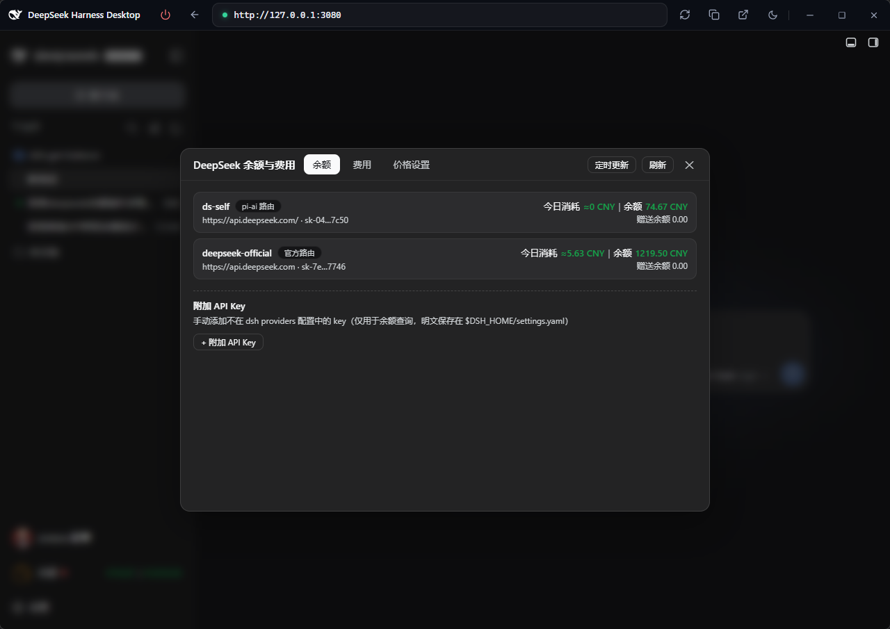

# dsh-get-balance

A balance & cost plugin for DeepSeek Harness:

- **Multi-account balance** — enumerates every DeepSeek provider (pi-ai routes / official route / extra keys), folds the same account into one row, and shows every account balance at a glance;
- **Real-time stats** — live per-session token usage and cost estimation, with online-editable price tiers (model × peak/off-peak);
- **Bilingual UI** — copy follows the host language (Simplified Chinese / English);
- **Friendly & simple** — one unified modal (Balance / Cost / Prices) plus a sidebar entry and a live session-header button; intuitive and ready to use.



[Simplified Chinese](README.zh-CN.md) · [Screenshots](preview.md)

## Features

### Balance tab

- Enumerates every DeepSeek provider:
  - entries from the host `llm-pi-ai` settings whose `baseURL` points at DeepSeek,
  - the official `llm-deepseek` route,
  - manually attached **extra API keys** (see below).
- Each API key row shows "**Today spend ≈xx CNY | Balance xx CNY**"
  (numbers green) — the key's own today cost (matched from the per-key cost
  stats by provider route, ≈0.00 when unused) plus its account balance.
- **One row per account**: when several routes resolve to the *same* API key
  (e.g. a pi-ai route named `deepseek` derives the credential ref
  `DEEPSEEK_API_KEY`, colliding with the official `llm-deepseek` default),
  they are folded into a single row — the row keeps its first entry and shows
  a chip for every route sharing the key (tooltip: "shares API key with …").
  The balance query runs once per distinct key, so the same account is never
  displayed twice with different names.
- For each provider the plugin resolves the configured `apiKeyEnv` via the host
  `credentials` service and calls the official
  `GET https://api.deepseek.com/user/balance` (proxied by the host — keys never
  reach the browser). Each row shows `total_balance` / `granted_balance`
  (+ topped-out flag) or the failure reason. Results are cached in memory for 60s;
  "Refresh" bypasses the cache.
- **Extra API keys**: keys outside any providers config can be attached directly
  from the modal (label + key, masked echo), persisted to
  `$DSH_HOME/dsh-get-balance.json`.

### Cost tab — per-API-key breakdown

- One **table**: columns *token / category / input (miss) / input (cache hit) /
  output / hit rate / est. cost*. Every API key is a group of four rows
  (**Last question / This session / Today·project / Today·all**) with the token
  cell merged across them (label + masked key + official/non-official chip);
  a **Total** group comes first, key groups follow sorted by token volume.
  Numbers are compact (K/M/B/T/P); hit rate = cache-hit ÷ all input-side tokens.
- **Token usage is counted per key regardless of officialness**; **cost is only
  computed for official keys** (API domain `api.deepseek.com`) — non-official keys
  show a "not billed" chip instead of an amount. Multiple official keys (several
  routes pointing at the official API) each get their own group and their own bill.
- **Multi-provider sessions are strictly split per provider**: token stats and
  cost estimates follow each request's own `request/context` provider, and each
  group carries a source chip (pi-ai route / official route) plus the
  official/non-official chip (alias routes are judged by baseURL hostname, so a
  pi-ai route pointing at `api.deepseek.com` bills as official), so providers
  never mix. The **Last question** entry prices every sample with its own model
  (per-sample model from `request/context`), not a session-wide model.
- **Aligned with the balance tab**: every configured provider is listed as a
  group whether or not it has usage — providers without usage (or without a
  credential) show zero tokens and a "—" amount.
- Official detection: the `provider` field of `request/context` events → that
  provider's baseURL in host settings → hostname equals `api.deepseek.com`
  (trailing slash / case normalized; lookalike domains such as
  `api.deepseek.com.xx.com` are not official).
- Last turn / session: in-memory event folding (same (turn,step)
  last-value-wins semantics as the official `tokenUsage` projection). Today
  entries: on-demand scan of `dshHomePath('sessions')` logs (`.jsonl` and
  `.jsonl.zstd`, frame-wise zstd decode, per-file memoized).

### Price settings tab — platform sub-tabs + official pricing-table layout

- **Platform sub-tabs** (currently DeepSeek only; more providers' pricing can be
  added later as additional sub-tabs).
- Mirrors the official price table layout minus the category column:
  `Model version` (colspan=2) + one column per model; three metric groups (input
  cache-hit / cache-miss / output, each rowspan=2) + off-peak/peak rows;
  **only the price cells are input boxes** (peak red, off-peak green).
- Each model has **peak and off-peak** sets of four prices (per million tokens:
  input / cache read / cache write / output, CNY).
- **Periods are configurable**: peak windows (cross-midnight supported) + a
  **timezone-offset slider** (UTC-12..+12, shown as UTC±0 / UTC+8 / UTC-5)
  + a **"weekends half price" toggle** (Saturdays & Sundays excluded from peak
  windows and billed at off-peak rates all day).
  Official default: Beijing 9:00–12:00 & 14:00–18:00 are peak; off-peak = peak × 0.5.
- Built-in fallback is the official V4 tiers (`deepseek-v4-flash` /
  `deepseek-v4-pro` / `deepseek-v4-flash-vision-exp`). Old flat-format
  config migrates automatically on first read (legacy built-in defaults upgrade to
  the official three tiers).

### Session-header live button

- Registered on `conversation.session.header.utilities`, showing
  **Session xxM | ≈¥xx** (both green, digits roll vertically odometer-style) —
  the current session's total tokens (compact K/M/B/T/P format) and its
  estimated cost.
- **Clicking the button refreshes once**; auto-refreshes at the configured interval;
  refreshes on session switch; and refreshes the moment each AI request completes
  (the host session snapshot gains a new `assistant` message node — request-level,
  not per streamed token), so a turn with several requests updates after each one.
  Only completions that hit the official DeepSeek API (api.deepseek.com) also
  force-refresh the footer balance (bypassing its 60s cache) — requests to
  non-official endpoints update tokens & cost only, without a balance query.
- **Per-provider breakdown popover**: since a session may switch providers
  mid-way, the button shows the **merged** totals; clicking opens a bubble
  popover listing each provider's own stats
  (`ds-self 268K | ≈¥0.41`, non-official rows show "not billed").

### Entry button (sidebar footer)

- `sidebar.footer.action` **Balance** button: the label and a period dot on the
  left, the amounts right-aligned ("Balance ¥110.00 | ¥99.50") — currency symbol
  prefix, digits in green and rolling vertically odometer-style on change.
  **One segment per provider (account), separated by `|`**; an account whose
  balance could not be fetched (no API key configured / query failed) shows a
  **red `--`** placeholder (hover shows the reason). The period is a
  small dot (**red** for peak hours / **green** for
  off-peak, half price) whose hover tooltip shows the full info
  "Currently peak hours · full price billing" / "Currently off-peak hours · half
  price billing" (full price in red / half price in green); the amounts come from
  the balance API.

### Auto refresh

- An **Auto** button (left of the Refresh button in the modal header) opens a
  config dialog: set the interval (seconds) → Start/Stop. While running, the input
  and the Start button are disabled; stopping re-enables them.
- At each interval, balance & cost refresh automatically (the modal when open, the
  header button otherwise). The interval is persisted to
  `$DSH_HOME/dsh-get-balance.json` and survives restarts.

### Config / packaging

- Schemastery `Config` (no required options) + a plugin-owned config file
  `$DSH_HOME/dsh-get-balance.json`: extra keys, price config and the auto-refresh
  interval are persisted there (JSON, versioned), never into the host's
  `settings.yaml`. Existing data stored in the old `dsh-balance` settings
  namespace is migrated automatically on first run.
- `dsh.bundle` + `dsh.client`(web) manifests; the official
  `deepseek-harness` project is never modified — everything rides existing slots
  and the HTTP / command channel.

### Plugin config file

- Location: `$DSH_HOME/dsh-get-balance.json` (next to `settings.yaml`).
- Contents (all fields optional on read; invalid values fall back to defaults):

  ```json
  {
    "version": 1,
    "extraKeys": [ { "id": "k1", "label": "main", "apiKey": "sk-..." } ],
    "prices": {
      "tiers": [
        { "id": "deepseek-v4-flash", "name": "deepseek-v4-flash", "currency": "CNY",
          "match": "deepseek-v4-flash",
          "peak": { "input": 3.0, "cacheRead": 0.10, "cacheWrite": 0, "output": 9.0 },
          "offPeak": { "input": 1.5, "cacheRead": 0.05, "cacheWrite": 0, "output": 4.5 } }
      ],
      "timezoneOffsetMinutes": 480,
      "peakWindows": [ { "start": "09:00", "end": "12:00" }, { "start": "14:00", "end": "18:00" } ],
      "weekendOffPeak": false
    },
    "autoRefreshSeconds": 0
  }
  ```

- It is read on every query and written atomically (temp file + rename) on save,
  so **hand-editing takes effect immediately** (no restart). A corrupted file is
  renamed to `dsh-get-balance.json.bak-<timestamp>` and defaults are used.

## Layout

```
├── src/host/*.ts       # host half: index.ts, providers.ts (enum + official check),
│                       # balance.ts, cost.ts (fold + today scan + period pricing +
│                       # official filter), ops.ts, config-file.ts (plugin config
│                       # file read/write + legacy settings migration),
│                       # fence.ts, types.ts
├── src/client/*        # browser half: plugin.tsx (slots + timer), BalanceModal.tsx,
│                       # HeaderButton.tsx, FooterButton.tsx, rpc.ts, store.ts,
│                       # i18n.ts, styles.ts, logo.ts
├── lib/index.js        # host bundle (tsdown ESM), committed for git installs
├── lib/client.js       # browser bundle (__ModuleLoader__ factory), committed
├── lib/types/          # declarations (tsc -b)
├── scripts/            # verify-client.mjs
├── tsdown.config.ts    # tsdown config (host + client banner wrap)
├── tsconfig.json       # solution: tsconfig.host.json / tsconfig.client.json
├── cordis.patch.yml    # bundle patch
├── package.json        # dsh.bundle + dsh.client(web) manifests + peerDependencies
├── README.md           # this file (English, default)
└── README.zh-CN.md     # Simplified Chinese docs
```

## Install

```sh
# published: npm / tarball / GitHub
dsh plugin --profile web add dsh-get-balance
dsh plugin --profile web add ./dsh-get-balance-0.1.0.tgz
dsh plugin --profile web add github:you/dsh-get-balance#<sha>

dsh --profile web --dump-config   # inspect the plugin layer
dsh --profile web                 # start
```

No static config required: extra keys, price config and the auto-refresh interval
are edited in the modal and persisted to `$DSH_HOME/dsh-get-balance.json`.

## Release

Toolchain: **tsc + tsdown** (no vite): `tsc -b` type-checks and emits
declarations; `tsdown` (Rolldown core) bundles the host half
(`lib/index.js`, ESM) and the browser half (`lib/client.js`, single-file CJS
`__ModuleLoader__` factory). Dependency manager: **pnpm 10**.

```sh
pnpm install     # per pnpm-lock.yaml
pnpm run build   # clean lib → tsc -b (types + declarations) → tsdown (both halves)
pnpm run verify  # simulate the host seed to validate lib/client.js (optional)
pnpm publish     # or pnpm pack / git push origin main (lib/ committed → git installs need no build)
```

### Auto publish (GitHub Actions)

Pushing a `v*` tag (`pnpm run release` bumps the patch version, rebuilds and
tags) triggers [`.github/workflows/publish.yml`](.github/workflows/publish.yml):

- **release job**: Setup Node → `pnpm install --frozen-lockfile` →
  `pnpm run check` → `pnpm run build` → `pnpm pack` → create GitHub Release;
- **publish-npm job**: publish to npm — requires the `NPM_TOKEN` repo secret.

## Development

Requirements: **Node ≥ 26 + pnpm 10** (pinned via the `packageManager` field).

```sh
pnpm install           # devDependencies: typescript, tsdown, @types/react, @deepseek-ai/* type packages…
pnpm run check         # full-tree TypeScript check (tsc -b)
pnpm run build         # rebuild both bundles after source changes (tsc -b && tsdown)
pnpm run verify        # validate lib/client.js against a simulated host seed
```

Attach the local checkout to a dsh instance (from the plugin repo):

```sh
cd dsh-get-balance
dsh plugin --profile web add ./
```

> The host loads `index.js` as native Node ESM, so
> `@deepseek-ai/schemastery`, `@deepseek-ai/dsh-tools`,
> `@deepseek-ai/dsh-settings`, `@deepseek-ai/dsh-home-paths` must resolve from
> the plugin directory (run `pnpm install` there; `node_modules` is gitignored).
> Host-half (`src/host/`) changes need a **dsh restart**; browser-half
> (`src/client/`) changes apply on a **page refresh**.

- Host half lives in `src/host/`; browser half in `src/client/`;
- The `window.__ModuleLoader__.load` factory wrap of `lib/client.js` is generated
  by tsdown's banner/intro/footer; external deps (`react` etc.) resolve through the
  host module table (seed) at runtime.

## Implementation notes

- **Browser ↔ host**: HTTP route `/dsh-balance/api` (POST JSON, host
  `webServer` + trust fence) with a `ctx.remote.commands.execute` fallback;
  errors carry a `code` that the client localizes.
- **Credentials**: the `credentials` service is looked up lazily per request
  (not captured at apply time), avoiding a "no credential" state when the host
  service starts late; the providers op returns `credentialsPresent` and per-entry
  `keySource` diagnostics.
- **Pricing**: `(uncachedInput × p_input + cacheRead × p_cacheRead +
  cacheWrite × p_cacheWrite + output × p_output) / 1e6` per million tokens, priced
  by each event's time (peak/off-peak).
- **Official filter**: `request/context` `provider` → baseURL in host settings →
  hostname == `api.deepseek.com`; non-official tokens are counted only
  (per-provider four buckets), never billed.
- **Today aggregation**: `dshHomePath('sessions')/<projectKey>/<sessionId>/session.jsonl(.zstd)`,
  decoded frame-wise via `zstdDecompressSync` from `node:zlib`.
- Peer deps (`@deepseek-ai/cordis`, dsh-tools, schemastery, dsh-settings,
  dsh-commands, dsh-session, dsh-api-remotes, client runtime / ui-slots /
  ui-settings / cordis-client-runner, `react`) are resolved by the host at install.
- The official `deepseek-harness` project is **never modified**; everything uses
  existing slots (`sidebar.footer.action`, `shell.overlay`,
  `conversation.session.header.utilities`) and the HTTP / command channel.
